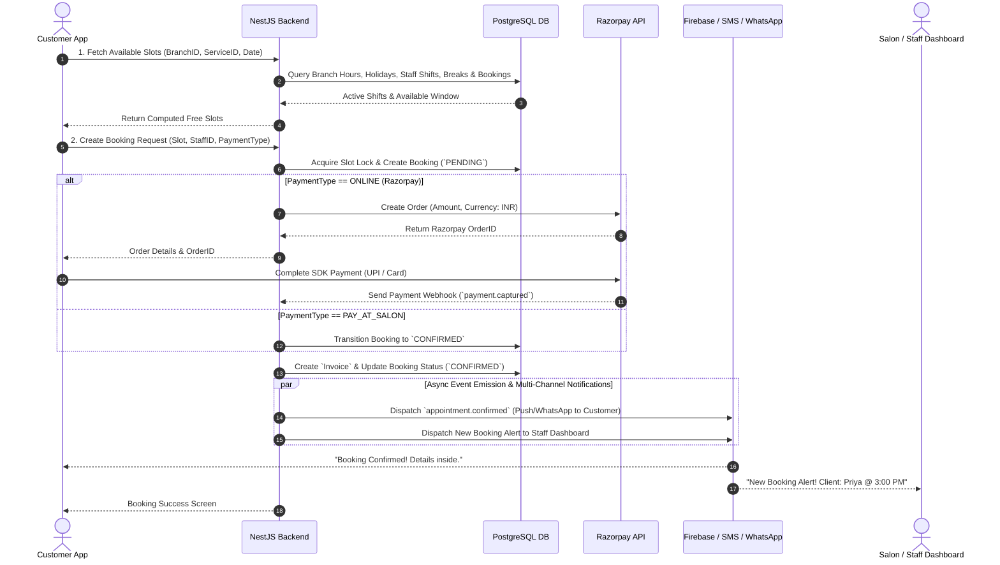

# Phase 1: Product Requirements Document (PRD)

## Salon Booking & Management Platform

**Version:** 1.2 (Production Architecture & Granular Refinements)  
**Date:** 2026-08-05  
**Author:** Technical Lead   
**Status:** Awaiting Final Approval  

---

## 1. Overview

This PRD defines the product requirements for a **production-ready Salon Booking & Management Platform** targeting the Indian market. The platform operates as a **marketplace** connecting customers with salon businesses, inspired by platforms like Fresha and Booksy, but localized for Indian market dynamics — including UPI-first payments (Razorpay), WhatsApp/SMS notification strategies, multi-branch scalability, and a flexible hybrid revenue model suited for Tier-1 through Tier-3 cities.

The platform comprises three applications backed by a single NestJS API:

| Application | Platform | Primary Users |
|---|---|---|
| Customer Mobile App | React Native + Expo | End customers |
| Salon Owner Dashboard | Next.js | Salon owners & staff |
| Super Admin Dashboard | Next.js | Platform operators |

---

## 2. Product Vision

> **Make salon discovery, booking, and management effortless for every Indian customer and salon owner — from metro cities to emerging towns.**

The platform aims to be the **single operating system for Indian salons**: customers find and book services in seconds, salon owners and staff run their daily operations efficiently, and platform operators maintain full governance and control.

---

## 3. Business Goals & Revenue Model

### 3.1 Business Goals

| # | Goal | Success Metric |
|---|---|---|
| BG-1 | Acquire salons across Tier-1, 2, 3 Indian cities | 500+ salons onboarded in Year 1 |
| BG-2 | Drive online bookings over walk-ins | 60%+ bookings via app within 6 months of salon onboarding |
| BG-3 | Generate revenue via flexible hybrid model | Positive unit economics per salon by Month 12 |
| BG-4 | Reduce salon no-shows | <10% no-show rate via reminders + prepayment options |
| BG-5 | Build customer loyalty & repeat bookings | 40%+ repeat booking rate within 6 months |
| BG-6 | Provide actionable operational tracking | Daily staff/owner dashboard engagement ≥5x/week |

### 3.2 Hybrid Revenue Model

To maximize market adoption across diverse salon segments in India, the platform supports two pricing tiers chosen by the salon owner:

```
                  ┌─────────────────────────────────────────┐
                  │          Salon Revenue Model            │
                  └────────────────────┬────────────────────┘
                                       │
                    ┌──────────────────┴──────────────────┐
                    ▼                                     ▼
      ┌───────────────────────────┐         ┌───────────────────────────┐
      │         FREE PLAN         │         │       PREMIUM PLAN        │
      ├───────────────────────────┤         ├───────────────────────────┤
      │ • ₹0 / month              │         │ • Flat ₹999 - ₹2,499 / mo │
      │ • Commission per booking  │         │ • 0% Commission           │
      │   (e.g., 5% - 10%)        │         │ • Priority Listing        │
      └───────────────────────────┘         └───────────────────────────┘
```

1. **Free Plan (Commission-Based):** Zero monthly fixed cost. Salon pays a configurable commission fee (e.g., 5-10%) on completed bookings made through the platform. Ideal for small salons and new onboarding.
2. **Premium Plan (Subscription-Based):** Monthly/Annual subscription fee (e.g., ₹999/mo per branch). Salon pays **0% commission** on bookings. Ideal for high-volume, established salons.

---

## 4. Architectural Foundation & Core Models

### 4.1 Domain Model Architecture

The core relational hierarchy ensures clean separation of concerns, centralized media management, decoupled billing, and multi-branch scalability from Day 1:

```
[ User ]
   │
   ├── (Role: CUSTOMER) ───────────► [ Appointment ] ◄────────── [ Service ]
   │                                      │                           ▲
   ├── (Role: SALON_OWNER)                ├───► [ Invoice ]           │
   │        │                             │         │          [ Branch_Service ]
   │        ▼                             │         ▼                 ▲
   │    [ Salon (Brand) ]                 │    [ Payment ]            │
   │        │                             │                           │
   │        └───► [ Branch (Location) ] ──┴───────────────────────────┤
   │                     │                                            │
   └── (Role: SALON_STAFF) ───► [ Staff ] ────────────────────────────┘
                                  │
                                  └───► [ Shift ] ───► [ Break / Leave / Vacation ]

   [ Centralized Media Asset Entity ]
   ┌─────────────────────────────────────────────────────────────┐
   │ Media (id, url, thumbnail_url, type, size, uploaded_by)    │
   └──────────────────────────────┬──────────────────────────────┘
                                  │ Referenced By
                                  ▼
           Salon Photos, Staff Avatars, Service Media, Receipts
```

**Domain Entity Chain:**
`User` ➔ `Salon (Brand)` ➔ `Branch (Location)` ➔ `Staff (Shift/Break)` ➔ `Branch_Service` ➔ `Appointment` ➔ `Invoice` ➔ `Payment` ➔ `Review` ➔ `Media`

> [!IMPORTANT]
> **Day-1 Branch & Media Architecture:** Even if a salon owner has 1 location during MVP, the system natively enforces the `Salon -> Branch -> Staff/Service` hierarchy and centralizes all files under a single `Media` asset model instead of scattering raw Cloudinary URLs.

### 4.2 Complete Appointment Lifecycle (State Machine)

Bookings transition through a deterministic lifecycle with audited timestamps for every state change:

```
                                 ┌─────────────────┐
                                 │     PENDING     │ (Booking created, payment pending if online)
                                 └────────┬────────┘
                                          │
                               ┌──────────┴──────────┐
                               ▼                     ▼
                     ┌──────────────────┐  ┌──────────────────┐
                     │    CONFIRMED     │  │    CANCELLED     │ (By Customer / Salon / System timeout)
                     └────────┬─────────┘  └──────────────────┘
                              │
                              ▼
                     ┌──────────────────┐
                     │    CHECKED_IN    │ (Customer arrived at salon)
                     └────────┬─────────┘
                              │
                              ▼
                     ┌──────────────────┐
                     │   IN_PROGRESS    │ (Service started by stylist)
                     └────────┬─────────┘
                              │
                              ▼
                     ┌──────────────────┐
                     │    COMPLETED     │ (Service finished, invoice generated & settled)
                     └────────┬─────────┘
                              │
                              ▼
                     ┌──────────────────┐
                     │  REVIEWED (P2)   │ (Customer leaves rating/review)
                     └──────────────────┘
```

### 4.3 Domain Events List (Event-Driven Architecture)

The system emits reactive domain events to decouple background tasks, notifications, invoice generation, and audit logging via NestJS EventEmitter & BullMQ queues:

| Event Name | Trigger Condition | Primary Listeners / Reactions |
|---|---|---|
| `booking.created` | Customer submits slot booking | Slot Lock Manager, FCM Notification Queue, Audit Log |
| `payment.initiated` | Order created in payment gateway | Payment Timeout Worker (5 min expiration timer) |
| `payment.successful` | Gateway webhook confirms payment | Update Booking to `CONFIRMED`, Trigger `invoice.generated` |
| `payment.failed` | Gateway transaction declines | Mark Payment `FAILED`, Release Slot Lock |
| `invoice.generated` | Payment or Pay-at-Salon confirmed | Email PDF Invoice Worker, Salon Payout Ledger Worker |
| `appointment.confirmed` | Booking confirmed & locked | Customer SMS/Push/WhatsApp Dispatcher, Salon Calendar Sync |
| `customer.checked_in` | Client arrives at salon counter | Staff Dashboard Alert, Queue Tracker |
| `appointment.in_progress` | Stylist begins haircut/service | Staff Timer Start, Activity Log |
| `appointment.completed` | Service finished by staff | Commission Ledger Calculator, WhatsApp Thank You Message |
| `appointment.cancelled` | Cancelled by client/salon | Refund Processor (if prepaid), Slot Unlocker, Notification |
| `appointment.no_show` | Client fails to arrive in 15 mins | No-show Counter Increment, Cancellation Ledger |
| `review.requested` | 2 hours post-appointment completion | Customer Push Notification (Phase 2) |

---

## 5. User Roles & Permission Matrix

### 5.1 User Roles

| Role | Code | Description | Primary Interface |
|---|---|---|---|
| Customer | `CUSTOMER` | End-user who searches, books, and pays for services | Mobile App |
| Salon Owner | `SALON_OWNER` | Business owner managing salon brand, branches, staff, settings | Salon Dashboard |
| Salon Staff | `SALON_STAFF` | Stylist/Barber viewing daily schedule & completing services | Staff / Salon Dashboard |
| Super Admin | `SUPER_ADMIN` | Platform operator managing approvals, plans, & system config | Admin Dashboard |
| Support Agent | `SUPPORT_AGENT` | Operations staff resolving customer & salon disputes | Limited Admin Dashboard |

### 5.2 Permission Matrix

| Feature / Action | Customer | Salon Staff | Salon Owner | Super Admin |
|---|:---:|:---:|:---:|:---:|
| Search & View Salons | ✅ | ✅ | ✅ | ✅ |
| Book Appointment | ✅ | ❌ | ❌ | ❌ |
| View Own Appointments | ✅ | ✅ (Assigned) | ✅ (All Branch) | ✅ (System-wide) |
| Cancel Booking | ✅ (Self) | ❌ | ✅ (Branch) | ✅ (System-wide) |
| Check-in / Start / Complete Booking | ❌ | ✅ | ✅ | ❌ |
| Create Walk-in Appointment | ❌ | ✅ | ✅ | ❌ |
| Manage Staff & Services | ❌ | ❌ | ✅ | ❌ |
| View Daily / Weekly Revenue | ❌ | ❌ | ✅ | ✅ |
| Approve / Reject Salon Registrations | ❌ | ❌ | ❌ | ✅ |
| Configure Platform Settings (Tax, Commission) | ❌ | ❌ | ❌ | ✅ |
| View Audit & Activity Logs | ❌ | ❌ | ✅ (Activity) | ✅ (Audit + Activity) |
| Moderate Reviews (Phase 2) | ❌ | ❌ | 💬 (Respond) | ✅ (Flag/Remove) |

---

## 6. User Stories

### 6.1 Customer User Stories

| ID | Story | Priority |
|---|---|---|
| CUS-001 | As a customer, I want to register/login via OTP on first use, and stay logged in via Refresh Token so I don't pay/wait for SMS every time | P0 |
| CUS-002 | As a customer, I want to search for salons/branches near my location so that I can find convenient options | P0 |
| CUS-003 | As a customer, I want to view a salon branch profile (photos, services, staff, working hours) | P0 |
| CUS-004 | As a customer, I want to browse services with prices, durations, and categories | P0 |
| CUS-005 | As a customer, I want to select services, choose a specific staff member (or "Any Available"), pick a slot, and book | P0 |
| CUS-006 | As a customer, I want to pay online (UPI, Card, Wallet) or choose Pay-at-Salon | P0 |
| CUS-007 | As a customer, I want to receive booking confirmation via push notification, SMS, and WhatsApp | P0 |
| CUS-008 | As a customer, I want to view my upcoming and past bookings with real-time status tracking | P0 |
| CUS-009 | As a customer, I want to cancel or reschedule a booking within the branch cancellation window | P0 |
| CUS-010 | As a customer, I want to rate and review a salon after appointment completion | P1 (Phase 2) |
| CUS-011 | As a customer, I want to save favorite salon branches | P1 (Phase 2) |
| CUS-012 | As a customer, I want to apply promotional coupons during checkout | P1 (Phase 2) |
| CUS-013 | As a customer, I want automated reminders (24h and 1h before appointment) | P0 |
| CUS-014 | As a customer, I want to manage my profile and notification preferences | P1 |
| CUS-015 | As a customer, I want to view nearby salon branches on an interactive map | P1 (Phase 2) |
| CUS-016 | As a customer, I want to filter salons by gender (Men/Women/Unisex), rating, distance, and price range | P0 |
| CUS-017 | As a customer, I want to book multiple services in a single appointment | P0 |

### 6.2 Salon Staff User Stories (MVP Core)

| ID | Story | Priority |
|---|---|---|
| STF-001 | As a salon staff member, I want to log in to the dashboard using my credentials | P0 |
| STF-002 | As a staff member, I want to view my daily shifts, break times, and assigned clients | P0 |
| STF-003 | As a staff member, I want to update appointment status (`CHECKED_IN`, `IN_PROGRESS`, `COMPLETED`) | P0 |
| STF-004 | As a staff member, I want to view service details and special instructions for my upcoming appointments | P0 |
| STF-005 | As a staff member, I want to log walk-in appointments quickly into available slots | P0 |

### 6.3 Salon Owner User Stories

| ID | Story | Priority |
|---|---|---|
| SAL-001 | As a salon owner, I want to register my salon brand & primary branch for platform approval | P0 |
| SAL-002 | As a salon owner, I want to manage branch operating hours, special holiday calendars, and emergency closures | P0 |
| SAL-003 | As a salon owner, I want to configure services with pricing, duration, and categories per branch | P0 |
| SAL-004 | As a salon owner, I want to manage staff shifts, scheduled breaks, and vacation leave requests | P0 |
| SAL-005 | As a salon owner, I want a master calendar to manage all branch appointments | P0 |
| SAL-006 | As a salon owner, I want a dashboard showing today's queue, activity feed, and daily/weekly/monthly revenue summary | P0 |
| SAL-007 | As a salon owner, I want to select between the Free (Commission) or Premium (Subscription) plan | P0 |
| SAL-008 | As a salon owner, I want to view simple revenue reports (Daily, Weekly, Monthly) | P0 |
| SAL-009 | As a salon owner, I want immediate notifications when a new booking is created or cancelled | P0 |
| SAL-010 | As a salon owner, I want an activity feed showing all staff actions (price edits, cancellations, shift changes) | P0 |

### 6.4 Super Admin User Stories

| ID | Story | Priority |
|---|---|---|
| ADM-001 | As an admin, I want to review and approve/reject salon branch onboarding requests | P0 |
| ADM-002 | As an admin, I want a macro dashboard showing platform GMV, revenue, active salons, and total bookings | P0 |
| ADM-003 | As an admin, I want to manage all system users (customers, owners, staff) — view, disable, audit | P0 |
| ADM-004 | As an admin, I want to configure dynamic Platform Settings (Taxes, Default Commission %, Max Booking Days, Buffers) | P0 |
| ADM-005 | As an admin, I want to inspect compliance Audit Logs (IP, User Agent, Old/New Value diffs for security changes) | P0 |

---

## 7. Functional Requirements

### 7.1 Cost-Optimized Authentication & Session Management

| ID | Requirement |
|---|---|
| FR-AUTH-001 | Phone + OTP verification required ONLY on first login or device change for customers. |
| FR-AUTH-002 | Short-lived Access Token (15m) + long-lived Refresh Token (30d) stored in SecureStore/HttpOnly cookie. |
| FR-AUTH-003 | Email + Password authentication for B2B accounts (Owners, Staff, Admins, Support Agents) with bcrypt (salt 12). |
| FR-AUTH-004 | Role-Based Access Control (RBAC) enforcing permissions defined in Section 5.2. |
| FR-AUTH-005 | Session revocation — support for terminating single device session (`POST /auth/logout`) or all active sessions across devices (`POST /auth/logout-all`). |
| FR-AUTH-006 | Password Management — Self-service Forgot Password (token-based reset link via email), Reset Password, and authenticated Change Password. |
| FR-AUTH-007 | Security & Lockout Controls — OTP max 3 failed attempt lockout (15m), B2B Account password lock (5 failed attempts -> 30m lock), and Refresh Token theft reuse detection with blanket session revocation. |

### 7.2 Multi-Branch, Operating Hours & Closure Governance

| ID | Requirement |
|---|---|
| FR-SALON-001 | Salon Brand registration with GSTIN (optional), brand logo, business contact. |
| FR-SALON-002 | Branch creation with address, geo-coordinates (Lat/Lng), and Media ID references. |
| FR-SALON-003 | **Granular Branch Hours Management:**
  - **Business Hours:** Regular weekly opening/closing schedule per day (e.g., Mon–Sat 9 AM – 9 PM, Sun 10 AM – 8 PM).
  - **Special Holidays:** Dated holiday closures (e.g., Diwali, Independence Day).
  - **Temporary Closures:** Emergency/ad-hoc branch closures (e.g., Heavy Rain, Electrical Maintenance). |

### 7.3 Granular Staff Shifts & Time-Off Management

| ID | Requirement |
|---|---|
| FR-STAFF-001 | **Shift Management:** Configurable working shifts per staff member (e.g., Shift A: 9 AM – 6 PM; Shift B: 12 PM – 9 PM). |
| FR-STAFF-002 | **Break Intervals:** Scheduled breaks during shift (e.g., Lunch 1 PM – 2 PM) where slots are automatically suppressed. |
| FR-STAFF-003 | **Staff Leave & Vacations:** Ad-hoc leave days or multi-day vacations that block slot generation for that staff member. |

### 7.4 Booking Engine & Real-Time Slots

| ID | Requirement |
|---|---|
| FR-BOOK-001 | Slot availability engine incorporating Branch Hours, Special Holidays, Temporary Closures, Staff Shifts, Breaks, Vacations, Service Durations, Buffers, and Existing Bookings. |
| FR-BOOK-002 | Multi-service sequential time calculation (Service A duration + Service B duration). |
| FR-BOOK-003 | Conflict prevention via Redis distributed lock during checkout. |

### 7.5 Decoupled Invoice & Payment Operations

| ID | Requirement |
|---|---|
| FR-PAY-001 | **Decoupled Billing Entities:** `Invoice` entity generated upon booking confirmation containing line items, taxes, discounts, and totals. `Payment` entity handles payment gateway attempts independently. |
| FR-PAY-002 | Razorpay gateway integration supporting UPI, Cards, NetBanking + Pay-at-Salon option. |
| FR-PAY-003 | Asynchronous invoice PDF generation and email delivery via background worker queue. |

### 7.6 Decoupled Notification Architecture

| ID | Requirement |
|---|---|
| FR-NOT-001 | **Decoupled Notification Pipeline:**
  `Notification` ➔ `Template` (Push / SMS / WhatsApp / Email) ➔ `Delivery Provider` ➔ `Status Tracker` (`QUEUED`, `SENT`, `DELIVERED`, `FAILED`, `READ`). |
| FR-NOT-002 | Multi-channel dispatch based on customer preferences and event severity. |

### 7.7 Simplified MVP Reports

| ID | Requirement |
|---|---|
| FR-RPT-001 | Daily, Weekly, and Monthly Revenue views for Salon Owners. |
| FR-RPT-002 | Macro GMV and Commission views for Super Admin. |

### 7.8 Dynamic Platform Settings

| ID | Requirement |
|---|---|
| FR-SET-001 | Admin-configurable settings stored in DB: Commission %, Tax %, Booking Buffer, Cancellation Window, Lead Time, Max Advance Days. |

### 7.9 Security Audit Log System

| ID | Requirement |
|---|---|
| FR-AUDIT-001 | Immutable `audit_logs` table recording all administrative, security, and schema changes. |
| FR-AUDIT-002 | Fields captured: `who_id`, `role`, `action`, `entity_type`, `entity_id`, `old_value_json`, `new_value_json`, `ip_address`, `user_agent`, `timestamp`. |

### 7.10 Operational Activity Log Feed

| ID | Requirement |
|---|---|
| FR-ACT-001 | Salon Dashboard Activity Feed showing real-time operational events (e.g., "Staff Rajesh checked-in Client Priya", "Price updated for Haircut", "Shift modified for Stylist Anita"). |

### 7.11 Centralized Media Asset Entity

| ID | Requirement |
|---|---|
| FR-MEDIA-001 | Centralized `media` table: `id` (UUID), `url`, `thumbnail_url`, `media_type` (IMAGE/DOCUMENT), `file_size`, `mime_type`, `uploaded_by_id`, `created_at`. |
| FR-MEDIA-002 | All domain models reference `media_id` instead of storing raw third-party URL strings directly. |

---

## 8. Sequence Diagram: Booking & Payment Flow

The end-to-end execution flow from slot selection to notification delivery:



---

## 9. Non-Functional Requirements

| ID | Category | Requirement | Target |
|---|---|---|---|
| NFR-001 | Performance | Read operations API latency | < 150ms (p95) |
| NFR-002 | Performance | Slot generation latency | < 250ms (p95) |
| NFR-003 | Scalability | Horizontal Pod Autoscaling (HPA) ready | Stateless NestJS API layer |
| NFR-004 | Security | Token Security | Access Token in memory, Refresh Token in SecureStore/HttpOnly |
| NFR-005 | Security | Sensitive Data Encryption | Passwords bcrypt (salt 12), API keys encrypted at rest |
| NFR-006 | Compliance | Auditability | 100% mutation logging in Audit Log |

---

## 10. Revised MVP, Roadmap & Future Integrations

### 10.1 Included in MVP (Phase 1 Build)

| Category | MVP Inclusion |
|---|---|
| **Authentication** | Phone+OTP (First login) + Refresh Token exchange, Staff & Owner Email/Pass, RBAC |
| **Architecture** | Multi-Branch Schema, Decoupled Invoices/Payments, Decoupled Notifications, Centralized Media Entity |
| **Branch & Staff** | Branch Business Hours, Special Holidays, Temp Closures, Staff Shifts, Breaks & Leave |
| **Staff Self-Service** | Staff Dashboard login, daily schedule view, booking status updates (`CHECKED_IN`, `IN_PROGRESS`, `COMPLETED`) |
| **Booking Engine** | Real-time slot generator with closure & break overrides, conflict locking |
| **Payments** | Razorpay (UPI/Card), Pay-at-Salon, Webhooks, Hybrid Plan calculation, Invoice generation |
| **Logs & Governance** | System Audit Log (Security) + Operational Activity Log Feed (Dashboard) |
| **Notifications** | Push (FCM), SMS (First OTP & Confirmations), WhatsApp Reminders |

### 10.2 Future Scope (Post-MVP Roadmap)

| Phase | Features | Target Rationale |
|---|---|---|
| **Phase 2** | Reviews & Ratings, Coupons & Promo Codes, Customer Map View, Favorite Salons | Engagement, trust, & growth marketing |
| **Phase 3** | Inventory Management, Advanced Analytics, Support Ticket System, Staff Mobile App | Enterprise operational tooling |
| **Phase 4** | Loyalty/Rewards Program, Customer Referral Engine, Multi-language Support | Retention & regional scale |

### 10.3 Strategic Future Integrations Roadmap

> Architectural hooks and abstraction interfaces will be designed during Phase 2/3 to support these future integrations:

- 📅 **Google Calendar & Apple Calendar Sync:** Bi-directional iCal / CalDAV integration for stylists and salon owners.
- 💬 **WhatsApp Business API Chatbot:** Automated booking confirmation, interactive reschedule bot via WhatsApp.
- 📍 **Google Business Profile Integration:** Auto-syncing salon profile, photos, and aggregate ratings with Google Maps.
- 🎯 **Meta Ads & Pixel Conversion:** Booking completion conversion tracking for salon marketing campaigns.
- 🖨️ **Thermal POS Counter Printers:** ESC/POS network/Bluetooth receipt printing directly from the Salon Dashboard.

---

## 11. Business Rules

| ID | Rule |
|---|---|
| BR-001 | Salons must be approved by Super Admin before their branches appear in customer search. |
| BR-002 | A booking slot requires Branch to be Open (No Special Holiday / Temp Closure), Staff on active Shift, and not during a Staff Break or Vacation. |
| BR-003 | Staff members cannot have overlapping active bookings (`CONFIRMED`, `CHECKED_IN`, `IN_PROGRESS`). |
| BR-004 | Customers on Free Plan salons incur commission % on checkout; Premium Plan salons incur 0% commission. |
| BR-005 | Free Cancellation is permitted up to `cancellation_hours_prior` (configured in Platform Settings). |
| BR-006 | Customer OTP expires after 5 minutes; max 3 OTP requests per phone per 15 minutes. Max 3 failed OTP verification attempts before 15-minute phone lockout. |
| BR-007 | B2B Password Lockout: 5 consecutive invalid password login attempts locks account for 30 minutes. |
| BR-008 | Refresh Token Theft Prevention: Submitting a previously rotated or revoked refresh token triggers automated token reuse detection, immediately revoking all active sessions for that user. |
| BR-009 | Payment failure does not cancel booking slot immediately; slot is held in `PENDING` state for exactly 5 minutes. |

---

## 12. Decisions & Trade-off Analysis

| Decision | Chosen Approach | Justification / Impact |
|---|---|---|
| **Invoice vs Payment** | Decoupled Entities | Invoice tracks line-item billing, taxes, discounts; Payment tracks gateway transaction state. Allows independent retries. |
| **Notification Pipeline** | Decoupled (`Template` -> `Delivery` -> `Status`) | Enables async delivery tracking, provider failover, and template localization cleanly. |
| **Centralized Media** | Unified `Media` Entity | Prevents orphaned Cloudinary URLs and standardizes file uploads across all domain entities. |
| **Audit vs Activity Log** | Two Distinct Systems | Audit Log captures security/compliance diffs (Admin view); Activity Log captures operational events (Owner view). |
| **Staff Schedule Depth** | Shifts + Breaks + Vacations | Prevents edge-case booking conflicts (e.g. client booking haircut during stylist lunch hour or vacation). |

---

## 13. Risk Assessment & Mitigation

| Risk | Consequence | Mitigation Strategy |
|---|---|---|
| Payment succeeds but Invoice generation fails | Incomplete records | Decoupled architecture with background retry queue for Invoice creation. |
| High SMS Gateway Costs | Margin erosion | Enforce Refresh Token login + WhatsApp notifications for non-critical alerts. |
| Double-Booking Race Conditions | Angry clients & stylists | Redis distributed lock during booking creation slot validation. |

---

## 14. Checklist

- [x] Product Vision & Business Goals updated with Hybrid Revenue model
- [x] Cost-Optimized Refresh Token OTP strategy documented
- [x] Staff Login elevated to P0 MVP core
- [x] Inventory removed & Reviews deferred to Phase 2
- [x] Granular Branch Hours (Business Hours, Special Holidays, Temp Closures) mapped
- [x] Granular Staff Shifts (Shifts, Breaks, Leaves, Vacations) mapped
- [x] Decoupled Invoice & Payment Entities defined
- [x] Decoupled Notification Architecture (Template, Delivery, Status) defined
- [x] Security Audit Log + Operational Activity Log defined
- [x] Centralized Media Asset Entity defined
- [x] Complete Domain Events List added for NestJS event-driven architecture
- [x] Strategic Future Integrations Roadmap added
- [ ] **Final Stakeholder Approval** ← Pending

---

## 15. Approval Request

> [!CAUTION]
> **STOP POINT — Phase 1 Document Updated (v1.2)**
> 
> All 8 new granular improvements, domain events list, and future integrations roadmap requested have been fully integrated into the PRD.
> 
> Please review the updated document and confirm:
> 1. **Approval** to proceed directly to **Phase 2 (Software Architecture)**, or
> 2. Any additional adjustments.
> 
> I will wait for your explicit approval before starting Phase 2.
