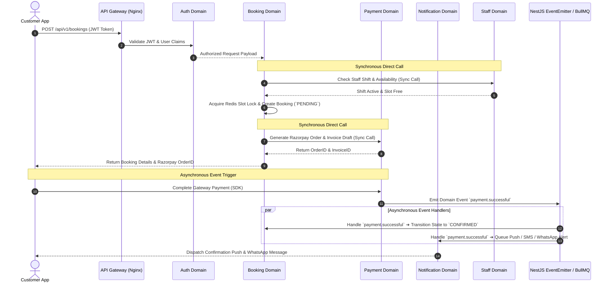
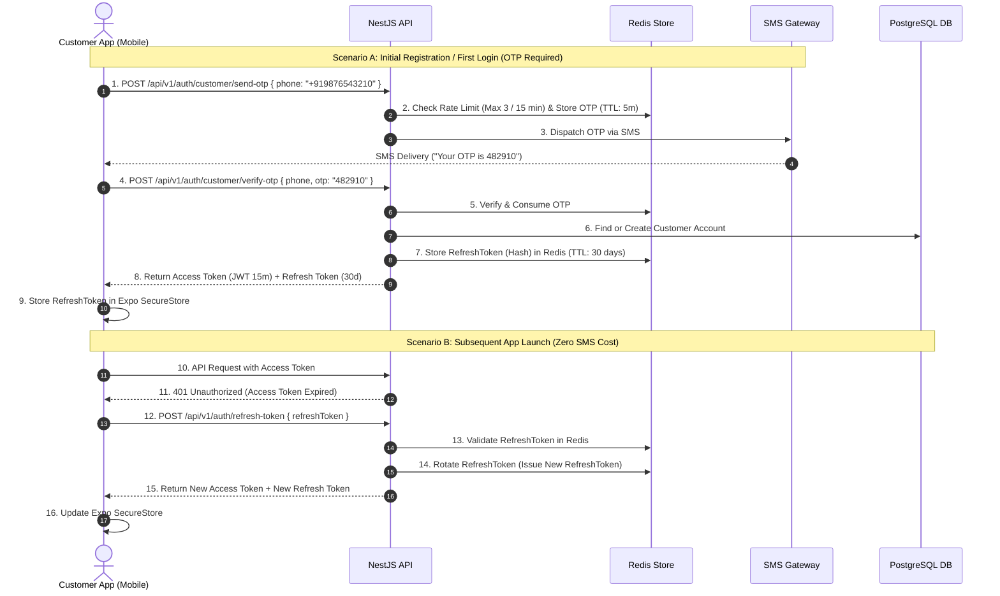

# Phase 2: Software Architecture Document

## Salon Booking & Management Platform

**Version:** 2.1 (Production Architecture & Granular Domain Refinements)  
**Date:** 2026-08-05  
**Author:** Chief Software Architect (Antigravity)  
**Status:** Awaiting Final Approval  
**Single Source of Truth:** PRD v1.2 Approved Specifications  

---

## 1. High-Level System Architecture

### 1.1 Overview
The platform uses a **Modular Monolith** backend architecture built with NestJS, serving three client applications via a unified RESTful API. The ingress pipeline routes traffic through Cloudflare (WAF/Edge DDoS protection) to an Nginx reverse proxy before reaching the stateless NestJS API cluster. Infrastructure is decoupled using Redis for caching and session state, BullMQ for asynchronous background job queues, PostgreSQL with Prisma ORM for relational persistence, and external cloud services for specialized capabilities (Razorpay for payments, Cloudinary for media assets, Firebase Cloud Messaging for push alerts, and SMS/WhatsApp gateways for communications).

### 1.2 System Architecture Diagram

```
                                    ┌─────────────────────────────────────────────────────────────┐
                                    │                     CLIENT APPLICATIONS                     │
                                    └──────────────────────────────┬──────────────────────────────┘
                                                                   │
           ┌───────────────────────────────────────┬───────────────┴───────────────┬───────────────────────────────────────┐
           │                                       │                               │                                       │
           ▼                                       ▼                               ▼                                       ▼
┌─────────────────────┐                 ┌─────────────────────┐                 ┌─────────────────────┐                 ┌─────────────────────┐
│ Customer Mobile App │                 │ Salon Dashboard App │                 │ Super Admin App     │                 │ Third-Party Webhooks│
│ (React Native/Expo) │                 │  (Next.js App Dir)  │                 │ (Next.js App Dir)   │                 │ (Razorpay/SMS/FCM)  │
└──────────┬──────────┘                 └──────────┬──────────┘                 └──────────┬──────────┘                 └──────────┬──────────┘
           │                                       │                               │                                       │
           └───────────────────────────────────────┼───────────────────────────────┴───────────────────────────────────────┘
                                                   │ HTTPS / REST (JSON)
                                                   ▼
                                    ┌──────────────────────────────┐
                                    │    CLOUDFLARE (WAF / EDGE)   │
                                    └──────────────┬───────────────┘
                                                   │
                                                   ▼
                                    ┌──────────────────────────────┐
                                    │      API GATEWAY / NGINX     │
                                    │   (SSL, Rate Limit, CORS)    │
                                    └──────────────┬───────────────┘
                                                   │
                                                   ▼
                                    ┌──────────────────────────────┐
                                    │     NestJS BACKEND CORE      │
                                    │      (Modular Monolith)      │
                                    └──────────────┬───────────────┘
                                                   │
      ┌─────────────────────────┬──────────────────┼──────────────────┬─────────────────────────┐
      │                         │                  │                  │                         │
      ▼                         ▼                  ▼                  ▼                         ▼
┌──────────────┐        ┌──────────────┐   ┌──────────────┐   ┌──────────────┐          ┌──────────────┐
│  PostgreSQL  │        │    Redis     │   │    BullMQ    │   │  Cloudinary  │          │   External   │
│ (Prisma ORM) │        │ (Cache/Locks)│   │(Async Workers│   │(Media Storage│          │ Gateways     │
└──────────────┘        └──────────────┘   └──────┬───────┘   └──────────────┘          │(Razorpay/FCM/│
                                                  │                                     │ SMS/WhatsApp)│
                                                  ▼                                     └──────────────┘
                                          ┌──────────────┐
                                          │ Queue Workers│
                                          └──────────────┘
```

### 1.3 Communication Flow & Component Roles
1. **Client Layer:**
   - **Customer App (RN/Expo):** Consumes REST API using Axios with automatic token refresh interceptor and offline-first caching for static assets.
   - **Salon & Admin Dashboards (Next.js):** Consumes REST API via React Query / TanStack Query for server state management, optimistic updates, and SSR for salon marketing profiles.
2. **Edge & Gateway Ingress Layer:**
   - **Cloudflare:** WAF rules, Bot Management, Edge Rate Limiting, Global CDN caching for web assets.
   - **Nginx (Reverse Proxy):** SSL termination, IP rate limiting, CORS policy enforcement, forwarding requests to NestJS cluster.
3. **Application Layer (NestJS Modular Monolith):** Executes domain business logic within bounded contexts (`domains/authentication`, `domains/salon`, `domains/booking`, `domains/payment`, `domains/notification`). Enforces RBAC guards, validation pipes, and global exception filters.
4. **Data Layer (PostgreSQL + Prisma):** Primary ACID transactional database. Enforces multi-branch schema relationships and unique index constraints.
5. **Caching & Lock Layer (Redis):** In-memory store for session refresh tokens, distributed locks during slot checkout, rate limiting buckets, and volatile read caches.
6. **Queue Layer (BullMQ):** Offloads non-blocking asynchronous processing (email generation, push notifications, SMS dispatches, webhook retries, daily financial aggregation).
7. **Storage Layer (Cloudinary):** Handles direct image uploads, thumbnail transformations, optimization, and CDN content delivery.

### 1.4 Architectural Decisions
- **AD-SYS-01:** Chosen Modular Monolith over Microservices. NestJS domain modules establish clean domain boundaries in a single repository, eliminating network latency between services, simplifying distributed transactions, and drastically reducing operational overhead.

---

## 2. Monorepo Architecture

### 2.1 Overview
The project is organized as a **Turborepo + pnpm workspaces** monorepo. Packages are named descriptively (`packages/database`, `packages/config`, `packages/types`, `packages/validation`, `packages/ui`, `packages/utils`) to reflect their functional responsibility cleanly.

### 2.2 Monorepo Directory Structure

```
saloon/
├── apps/
│   ├── api/                        # NestJS Backend Application
│   │   ├── src/
│   │   │   ├── core/               # Infrastructure (DB, Redis, BullMQ, Feature Flags)
│   │   │   ├── common/             # Interceptors, Filters, Guards, Middleware
│   │   │   └── domains/            # Domain Bounded Contexts
│   │   ├── test/
│   │   ├── Dockerfile
│   │   ├── nest-cli.json
│   │   ├── package.json
│   │   └── tsconfig.json
│   ├── customer-app/               # React Native + Expo Customer Mobile App
│   │   ├── app/                    # Expo Router directory
│   │   ├── src/
│   │   ├── app.json
│   │   ├── package.json
│   │   └── tsconfig.json
│   ├── salon-dashboard/            # Next.js Salon Owner & Staff Web Dashboard
│   │   ├── src/
│   │   │   ├── app/                # Next.js App Router
│   │   │   └── components/
│   │   ├── package.json
│   │   └── tsconfig.json
│   └── super-admin/                # Next.js Super Admin Web Dashboard
│       ├── src/
│       │   ├── app/                # Next.js App Router
│       │   └── components/
│       ├── package.json
│       └── tsconfig.json
├── packages/
│   ├── config/                     # Shared ESLint, Prettier, Tailwind configs
│   │   ├── eslint/
│   │   ├── typescript/
│   │   └── package.json
│   ├── database/                   # Prisma Schema, Migrations, & Prisma Client Export
│   │   ├── prisma/
│   │   │   └── schema.prisma
│   │   ├── src/
│   │   │   └── index.ts
│   │   └── package.json
│   ├── types/                      # Shared TypeScript Interfaces, Enums, DTO Types
│   │   ├── src/
│   │   │   ├── enums/
│   │   │   ├── models/
│   │   │   └── api/
│   │   └── package.json
│   ├── validation/                 # Shared Zod / Class-Validator Schemas
│   │   ├── src/
│   │   └── package.json
│   ├── ui/                         # Shared Cross-Platform UI Design Tokens & Web Components
│   │   ├── src/
│   │   └── package.json
│   └── utils/                      # Shared Helper Functions (Formatting, Date/Time, Currency)
│       ├── src/
│       └── package.json
├── tooling/                        # Build scripts, CI runner configs, Docker Compose
│   ├── docker/
│   │   ├── docker-compose.dev.yml
│   │   └── docker-compose.prod.yml
├── pnpm-workspace.yaml
├── turbo.json
├── package.json
├── .gitignore
└── README.md
```

### 2.3 Package Responsibilities & Directory Explanations
1. `apps/api`: NestJS REST API server instance.
2. `apps/customer-app`: React Native Expo mobile app targeting iOS & Android.
3. `apps/salon-dashboard`: Next.js web application for Salon Owners & Staff.
4. `apps/super-admin`: Next.js web application for Platform Operators.
5. `packages/database`: Single authority for `schema.prisma`, generated Prisma Client, and seed scripts. (Renamed from `db` for readability alongside `config`, `types`, `validation`, `ui`, `utils`).
6. `packages/types`: Universal TypeScript types (enums, model representations, API payload contracts) consumed by all 4 applications.
7. `packages/validation`: Unified validation logic (Zod schemas) shared between frontend forms and backend DTOs.
8. `packages/ui`: Shared React web components and Tailwind tokens used by both Next.js applications (`salon-dashboard` & `super-admin`).
9. `packages/utils`: Pure utility functions (IST date formatters, Indian Rupee currency formatters, distance calculators).

---

## 3. Backend Architecture (NestJS Modular Monolith)

### 3.1 Overview
The NestJS application implements a **Clean Architecture + Domain-Driven Bounded Context Pattern**. Code is organized inside `apps/api/src/domains/` rather than generic technology layers.

### 3.2 Inter-Domain Communication Architecture Diagram

The diagram below visualizes how requests flow through NestJS domains and how domains communicate directly vs via reactive events:



### 3.3 Backend Directory Structure (`apps/api/src/`)

```
apps/api/src/
├── core/                           # Infrastructure & Platform Engines
│   ├── database/                   # Prisma Service & Health Check
│   ├── redis/                      # Redis Client Provider & Slot Lock Service
│   ├── queue/                      # BullMQ Queue Registrations & Producers
│   ├── scheduler/                  # NestJS Schedule Module & Cron Workers
│   ├── feature-flags/              # Dynamic Feature Flag Provider Service
│   └── core.module.ts
├── common/                         # Universal NestJS Pipeline Components
│   ├── decorators/                 # @CurrentUser(), @Roles(), @Public()
│   ├── filters/                    # AllExceptionsFilter, DomainExceptionFilter
│   ├── guards/                     # JwtAuthGuard, RolesGuard, RateLimitGuard
│   ├── interceptors/               # TransformInterceptor, LoggingInterceptor
│   ├── middleware/                 # CorrelationIdMiddleware
│   ├── pipes/                      # Custom ValidationPipes
│   └── common.module.ts
├── domains/                        # Bounded Context Domain Modules
│   ├── authentication/             # OTP, JWT, Refresh Token Rotation, Session Revocation
│   │   ├── dto/
│   │   ├── guards/
│   │   ├── strategies/
│   │   ├── authentication.controller.ts
│   │   ├── authentication.service.ts
│   │   └── authentication.module.ts
│   ├── salon/                      # Brands, Branches, Business Hours, Special Holidays, Temp Closures
│   ├── staff/                      # Staff Profiles, Shifts, Breaks, Leaves, Vacations
│   ├── service/                    # Categories, Services, Pricing Variants
│   ├── booking/                    # Slot Engine, Checkout Lock, State Machine, Walk-ins
│   ├── payment/                    # Invoices, Razorpay Webhook Handler, Payout Ledgers
│   ├── notification/               # Templates, Dispatcher, FCM / SMS / WhatsApp Consumers
│   ├── search/                      # Location-based & Category Search Abstraction Engine
│   ├── audit/                      # Immutable Security Audit Log Writer
│   ├── activity/                   # Dashboard Activity Feed Engine
│   └── settings/                   # Dynamic Platform Settings Provider
├── main.ts                         # Bootstrap, Swagger Docs, Global Pipes
└── app.module.ts                   # Root Module importing Core & Domain modules
```

### 3.4 NestJS Scheduler & Cron Architecture
The platform utilizes `@nestjs/schedule` combined with BullMQ repeatable jobs to execute critical periodic tasks reliably without blocking HTTP requests:

| Job Name | Schedule | Execution Scope | Purpose |
|---|---|---|---|
| `reminder.24h` | Every 15 Minutes | `domains/notification` | Scans appointments 24h away; dispatches 24h reminder push/WhatsApp |
| `reminder.1h` | Every 5 Minutes | `domains/notification` | Scans appointments 1h away; dispatches 1h urgent SMS/push reminder |
| `cleanup.slot_locks` | Every 1 Minute | `domains/booking` | Releases orphan Redis slot locks older than 5 minutes for unpaid bookings |
| `reconciliation.payments`| Every 6 Hours | `domains/payment` | Queries Razorpay API for stuck `PENDING` orders; reconciles missing webhooks |
| `reports.daily_summary` | Daily at 00:05 IST | `domains/salon` | Compiles daily revenue totals and emails daily digests to Salon Owners |
| `cleanup.audit_logs` | Monthly (1st at 02:00) | `domains/audit` | Archives audit logs older than compliance policy thresholds |

### 3.5 Feature Flags Engine
To enable/disable experimental or future capabilities (e.g. AI Hairstyles, WhatsApp Chatbot Booking, Interactive Map View) without redeploying code:
- **`FeatureFlagService`** checks Redis key `cache:feature_flags` (backed by DB table `feature_flags`).
- Usage via NestJS Decorator: `@FeatureFlag('AI_HAIRSTYLES_ENABLED')` Guard.

### 3.6 Search Domain Architecture (Future-Ready Abstraction)
- **`SearchDomain` Interface:** Abstract adapter pattern (`ISearchAdapter`).
- **MVP Implementation:** PostgreSQL `pg_trgm` fuzzy text search + `PostGIS` / `Haversine` geo-distance queries.
- **Future Integration:** Pluggable adapter for Elasticsearch / Algolia / Meilisearch via simple config swap without touching business code.

---

## 4. Frontend Architecture

### 4.1 Customer Mobile App Architecture (React Native + Expo)

```
apps/customer-app/src/
├── app/                            # Expo Router (File-based Routing)
│   ├── (auth)/                     # Auth Stack (Login OTP, Register)
│   ├── (main)/                     # Main Tab Navigator (Home, Search, Bookings, Profile)
│   ├── salon/[id].tsx              # Salon Details Screen
│   ├── booking/[id].tsx            # Slot Selection & Payment Screen
│   └── _layout.tsx
├── components/                     # Mobile Design System Components
├── hooks/                          # Custom React Hooks (useAuth, useLocation, useSlots)
├── services/                       # API Service Layer (Axios Instance with Refresh Interceptor)
├── store/                          # Zustand State Stores (auth.store, booking.store)
└── utils/                          # Mobile Utilities (SecureStore, Haptics)
```

### 4.2 Salon Dashboard Architecture (Next.js App Router)

```
apps/salon-dashboard/src/
├── app/                            # Next.js App Router
│   ├── (auth)/                     # Owner / Staff Login Pages
│   ├── (dashboard)/                # Protected Dashboard Layout
│   │   ├── page.tsx                # Today's Appointments & Activity Feed
│   │   ├── calendar/page.tsx       # Master Calendar View
│   │   ├── staff/page.tsx          # Staff & Shift Management
│   │   ├── services/page.tsx       # Service Catalog
│   │   ├── hours/page.tsx          # Operating Hours, Holidays & Closures
│   │   └── reports/page.tsx        # Daily/Weekly/Monthly Revenue
│   └── layout.tsx
├── components/                     # Web Components (Tailwind + Radix UI)
├── services/                       # API Services (Axios)
└── store/                          # Zustand Stores
```

### 4.3 Super Admin Dashboard Architecture (Next.js App Router)

```
apps/super-admin/src/
├── app/
│   ├── (dashboard)/
│   │   ├── page.tsx                # Macro Platform Metrics (GMV, Commission)
│   │   ├── salons/page.tsx         # Salon Approval Queue
│   │   ├── users/page.tsx          # User Governance
│   │   ├── settings/page.tsx       # Dynamic Platform Settings Engine
│   │   └── audit/page.tsx          # Security Audit Log Viewer
```

---

## 5. Shared Packages Architecture

### 5.1 Package Ownership & Dependency Matrix

| Package Name | Scope & Purpose | Dependencies | Consumed By |
|---|---|---|---|
| `@salon/config` | ESLint, Prettier, TypeScript configurations | None | All apps & packages |
| `@salon/database` | Prisma Schema, Client export, Seeders | `@prisma/client` | `apps/api` |
| `@salon/types` | Shared Enums, DTO interfaces, API Response contracts | None | All apps & packages |
| `@salon/validation` | Shared Zod schemas for forms & API payloads | `zod` | All apps & packages |
| `@salon/ui` | Tailwind design tokens, shared web components | `react`, `tailwind` | `salon-dashboard`, `super-admin` |
| `@salon/utils` | Pure utility functions (formatting, date math) | `date-fns` | All apps & packages |

---

## 6. Authentication & Session Architecture

### 6.1 Cost-Optimized Customer Auth Sequence Diagram



---

## 7. API Architecture, Versioning & Sunset Deprecation Policy

### 7.1 REST Conventions & Versioning Prefix
- **Current Version:** `/api/v1/...`
- **Resource Naming:** Plural nouns (`/api/v1/salons`, `/api/v1/appointments`).

### 7.2 Version Deprecation & Sunset Lifecycle Policy
When a future major API version (`v2`) is introduced:
1. **Deprecation Header Notice:** `v1` endpoints append RFC 8594 standard headers:
   `Deprecation: @1780000000` (Timestamp when version was deprecated).
   `Sunset: Wed, 01 Dec 2026 00:00:00 GMT` (Hard shutdown date).
   `Link: </api/v2/appointments>; rel="successor-version"`
2. **Minimum Sunset Window:** Minimum **90-day grace period** before shutting down deprecated versions to allow client app updates.
3. **Backward Compatibility:** Minor changes (adding fields) occur within `v1`; breaking changes (removing/renaming required fields) trigger major version `v2`.

### 7.3 Standard Envelope Contracts

#### Success Response Envelope (`ApiSuccessResponse<T>`)
```json
{
  "success": true,
  "statusCode": 200,
  "message": "Operation completed successfully",
  "data": {},
  "meta": {
    "timestamp": "2026-08-05T11:15:00.000Z",
    "correlationId": "req_8819204-12948"
  }
}
```

#### Paginated Response Envelope (`ApiPaginatedResponse<T>`)
```json
{
  "success": true,
  "statusCode": 200,
  "data": [],
  "meta": {
    "page": 1,
    "limit": 20,
    "totalItems": 142,
    "totalPages": 8,
    "hasNextPage": true,
    "hasPrevPage": false,
    "timestamp": "2026-08-05T11:15:00.000Z",
    "correlationId": "req_8819204-12948"
  }
}
```

#### Error Response Envelope (`ApiErrorResponse`)
```json
{
  "success": false,
  "statusCode": 400,
  "error": "BAD_REQUEST",
  "message": "Validation failed",
  "details": [
    {
      "field": "phone",
      "issue": "Phone number must be a valid Indian number (+91XXXXXXXXXX)"
    }
  ],
  "meta": {
    "timestamp": "2026-08-05T11:15:00.000Z",
    "correlationId": "req_8819204-12948"
  }
}
```

---

## 8. Redis Architecture

### 8.1 Data Allocation & TTL Strategy

| Key Category | Key Format Pattern | Redis Data Type | TTL | Purpose |
|---|---|---|---|---|
| **OTP Store** | `otp:<phone>` | String | 5 Minutes | Verification during initial customer registration |
| **OTP Rate Limit** | `ratelimit:otp:<phone>` | Counter | 15 Minutes | Max 3 OTP requests per phone window |
| **API Rate Limit** | `ratelimit:api:<ip>` | Sliding Window | 1 Minute | Prevents API flooding |
| **Refresh Session** | `auth:refresh:<userId>:<deviceId>` | String (Hash) | 30 Days | Session validation & multi-device revocation |
| **Slot Checkout Lock**| `lock:slot:<staffId>:<timestamp>` | Redlock / String | 5 Minutes | Lock slot during booking payment checkout |
| **Platform Settings** | `cache:platform_settings` | String (JSON) | 24 Hours | Cached dynamic settings (Tax %, Buffer, etc.) |
| **Feature Flags** | `cache:feature_flags` | String (JSON) | 1 Hour | Cached feature toggles |
| **Salon Profile Cache**| `cache:salon:profile:<branchId>` | String (JSON) | 1 Hour | Rapid read caching for popular salon profiles |

---

## 9. BullMQ Queue Architecture

### 9.1 Queue Consumer Specifications
1. `notifications-queue`: Processes FCM push messages, SMS dispatches, and WhatsApp Business API payloads. Retries 3x with exponential backoff.
2. `invoices-queue`: Generates PDF invoice binaries asynchronously upon `payment.successful` and sends email receipts.
3. `reconciliations-queue`: Scheduled cron queue (runs every 6 hours) checking stuck `PENDING` transactions against Razorpay API to reconcile orphan payments.
4. `audits-queue`: Asynchronously writes security audit log events to PostgreSQL without adding latency to primary HTTP requests.

---

## 10. File Storage Architecture (Cloudinary Integration)

### 10.1 Centralized Media Lifecycle & Optimization Flow
Direct signed uploads to Cloudinary CDN linked to the central `media` entity in PostgreSQL. Image assets auto-converted to `.webp` format.

---

## 11. Security Architecture (OWASP Compliant)

OWASP Top 10 controls enforcing JWT authentication, RBAC permission matrix guards, `@ThrottlerGuard` rate limiting, `ValidationPipe` input sanitization, SameSite CSRF cookies, CORS origin whitelisting, and immutable security audit logs.

---

## 12. Logging Architecture

Structured JSON logs (Pino / Winston) outputting to `stdout` with correlation IDs (`correlationId`). Retention: Application logs (14 days), Error logs (90 days via Sentry), Audit logs (1+ year for compliance).

---

## 13. Deployment Architecture

Multi-stage Alpine Docker containers deployed behind Cloudflare (WAF) and Nginx reverse proxy with Kubernetes Horizontal Pod Autoscaling (HPA) and rolling zero-downtime releases.

---

## 14. Environment Configuration Strategy

Strict multi-environment separation (`dev`, `test`, `stage`, `prod`) using isolated database instances, Redis namespaces, and credential keys.

---

## 15. Error Handling Strategy

NestJS exception filter pipeline separating domain business exceptions (`BaseDomainException`) from generic HTTP/system exceptions caught by `AllExceptionsFilter`.

---

## 16. Caching Strategy

Cache-Aside pattern for read-heavy salon profiles and service catalogs, invalidated reactively via `salon.updated` domain events.

---

## 17. Monitoring & Observability Stack

- **Health Endpoints:** `/health/liveness` and `/health/readiness` (NestJS Terminus).
- **Error Tracking:** Sentry SDK real-time exception alerting.
- **Metrics Dashboard:** Prometheus metrics exported via `/metrics`, visualized in **Grafana** dashboards (HTTP latency p95/p99, queue depth, DB pool utilization, active sockets).

---

## 18. Architectural Boundaries & Cross-Domain Dependency Matrix

### 18.1 Unidirectional Layer Rules
1. Domain Entities & Shared Types cannot import from NestJS Controllers, Services, or Prisma Repositories.
2. Frontend applications MUST NOT import `@salon/database`. Database access is strictly encapsulated within `apps/api`.

### 18.2 Cross-Domain Dependency Matrix

The table below defines which backend domain module is permitted to invoke another domain directly (synchronous NestJS Service call) versus asynchronously (via Domain Events / BullMQ):

| Caller Domain | Can Call Directly (Sync Service) | Can Trigger (Async Event) | CANNOT Call / Forbidden |
|---|---|---|---|
| **`booking`** | `staff`, `service`, `salon`, `payment` | `notification`, `audit`, `activity` | Direct call to `notification` or `audit` |
| **`payment`** | `invoice`, `settings` | `booking`, `notification`, `audit` | Direct call to `booking` status state machine |
| **`salon`** | `staff`, `service`, `media` | `audit`, `activity` | Direct call to `booking` or `payment` |
| **`staff`** | `salon`, `media` | `activity` | Direct call to `booking` or `payment` |
| **`authentication`**| `user`, `redis` | `audit` | Direct call to `booking`, `salon`, or `payment` |
| **`notification`**| `user`, `template` | None | **Terminal Domain** — Cannot call any business domain |
| **`audit`** | `user` | None | **Terminal Domain** — Cannot call any business domain |
| **`search`** | `salon`, `service` | None | Read-only adapter domain |

> [!IMPORTANT]
> **Architectural Boundary Rule:** High-frequency event domains (`notification`, `audit`, `activity`) are **terminal consumer domains**. They NEVER make synchronous dependencies back into core business domains (`booking`, `payment`). Communication is strictly one-way via domain events.

---

## 19. Architectural Decision Records (ADRs)

- **ADR-01:** Modular Monolith over Microservices
- **ADR-02:** Phone + OTP First Login with Refresh Token Rotation
- **ADR-03:** Decoupled Invoice and Payment Entities
- **ADR-04:** Redis Distributed Locks for Slot Selection
- **ADR-05:** Native Day-1 Branch Hierarchy (`Salon` -> `Branch`)
- **ADR-06:** Turborepo + pnpm Monorepo layout
- **ADR-07:** Asynchronous Event Emission for Non-Blocking Operations
- **ADR-08:** Centralized Media Asset Entity (`packages/database`)
- **ADR-09:** Cloudflare -> Nginx -> NestJS Ingress Pipeline
- **ADR-10:** Terminal Event Pattern for Cross-Domain Communication

---

## 20. Architecture Risks & Mitigation Matrix

| Risk Category | Identified Risk | Technical Consequence | Mitigation Strategy |
|---|---|---|---|
| **Scalability** | High concurrent slot searches during peak holiday hours | Database CPU spike from real-time slot calculations | Cache staff shifts and static branch hours in Redis; compute availability over pre-filtered windows. |
| **Security** | Refresh Token theft on compromised mobile devices | Unauthorized account access | Store Refresh Tokens in OS SecureStore (Keychain/Keystore); enforce IP/User-Agent rotation checks. |
| **Integrations** | Razorpay Webhook drop or network timeout | Paid booking stuck in `PENDING` state | Idempotent Webhook Receiver + BullMQ 6-hour cron reconciliation worker querying Razorpay API. |
| **Operational** | Unbounded BullMQ Queue growth during SMS gateway outage | Redis memory exhaustion | Set job TTLs, max retry caps (3x), and route failing dispatches to Dead Letter Queue (DLQ) with alert trigger. |

---

## 21. Checklist

- [x] High-Level System Architecture with Cloudflare ➔ Nginx ➔ NestJS pipeline
- [x] Renamed package `packages/database` in Turborepo hierarchy
- [x] Backend architecture organized into `domains/` bounded contexts
- [x] Inter-Domain Communication Sequence Diagram (Mermaid)
- [x] Grafana metrics dashboards added alongside Prometheus & Sentry
- [x] Feature Flags Engine architecture defined
- [x] NestJS Scheduler & Cron Architecture detailed (24h/1h reminders, cleanup, reconciliation)
- [x] Search Domain Abstraction Layer defined
- [x] API Version Deprecation & Sunset Lifecycle Policy added
- [x] Cross-Domain Dependency Matrix documented
- [x] 10 Architectural Decision Records (ADRs)
- [ ] **Final Architecture Approval** ← Pending

---

## 22. Approval Request

> [!CAUTION]
> **STOP POINT — Phase 2 Architecture v2.1 Complete**
> 
> All 10 user-requested refinements have been seamlessly integrated into the Software Architecture Document.
> 
> Please review and confirm:
> 1. **Approval** to proceed to **Phase 3 (Database Design)**, or
> 2. Any additional adjustments.
> 
> I will wait for your explicit approval before moving to Phase 3.
