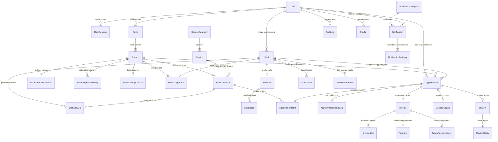

# Phase 3: Logical Database Architecture Specification

## Salon Booking & Management Platform

**Version:** 3.1 (Production Architecture & Granular Entity Refinements)  
**Date:** 2026-08-05  
**Author:** Principal Database Architect (Antigravity)  
**Status:** Awaiting Final Approval  
**Single Source of Truth:** PRD v1.2 & Software Architecture v2.1  

---

## 1. Database Design Principles & Naming Standards

### 1.1 Overview
The logical database architecture is designed to serve as the core transactional engine for a multi-tenant, multi-branch marketplace platform capable of scaling to **100,000+ salons**, **millions of customers**, and **tens of millions of appointments**. The design strictly adheres to 3rd Normal Form (3NF) for transactional write safety, utilizing domain-driven isolation, explicit foreign key constraints, idempotent state transitions, and auditability.

### 1.2 Database Philosophy & Core Pillars
- **Strict Normalization (3NF):** Zero redundancy in core transactional entities. Reporting aggregations are decoupled via Materialized Views and background workers.
- **Relational Integrity First:** Hard database-level foreign key constraints, unique indexes, and check constraints prevent invalid states regardless of application-level bugs.
- **Immutability of Financial & Security Records:** Financial ledger entries, invoices, and security audit logs are append-only. They can never be updated or hard-deleted.
- **Multi-Tenant Authorization Isolation:** Data isolation is enforced using indexed foreign keys (`salon_id`, `branch_id`) on all branch-scoped entities.
- **Soft Delete Pattern:** Historical domain data is preserved using partial-indexed `deleted_at` timestamps to ensure non-destructive operations and full audit capability.

### 1.3 Database Naming Standards & Conventions
To ensure long-term maintainability, all database objects follow strict, consistent naming conventions:

| Database Element | Naming Convention Pattern | Example |
|---|---|---|
| **Tables / Entities** | `snake_case`, plural | `users`, `staff_assignments`, `branch_services` |
| **Columns** | `snake_case`, singular | `first_name`, `appointment_date`, `is_primary` |
| **Primary Key Constraint** | `pk_<table_name>` | `pk_users`, `pk_appointments` |
| **Foreign Key Constraint** | `fk_<source_table>_<target_table>` | `fk_staff_assignments_staff`, `fk_appointments_branch` |
| **Unique Constraint / Index**| `uq_<table_name>_<column_names>` | `uq_users_phone`, `uq_coupons_code` |
| **B-Tree Index** | `idx_<table_name>_<column_names>` | `idx_appointments_branch_date`, `idx_staff_shifts_day` |
| **Check Constraint** | `chk_<table_name>_<rule_name>` | `chk_branch_services_price_positive` |
| **Native Enum Type** | `enum_<name>` | `enum_appointment_status`, `enum_user_role` |

### 1.4 Why PostgreSQL Was Chosen
PostgreSQL 16+ is selected as the primary relational database for five fundamental reasons:
1. **ACID Transactional Guarantees:** Absolute reliability for slot bookings, financial ledger writes, and status state machine transitions under high concurrency.
2. **Rich Indexing Architecture:** Native B-Tree, Partial Indexes, Composite Indexes, and GIN/GiST indexes for location-based geo-searches (`PostGIS`).
3. **Advanced Concurrency Control:** Row-level locking (`SELECT ... FOR UPDATE`), advisory locks, and MVCC (Multi-Version Concurrency Control) preventing double-bookings.
4. **Declarative Table Partitioning:** Native range partitioning for high-volume tables (`appointments`, `audit_logs`).
5. **JSONB & Extension Ecosystem:** Native support for `JSONB` data, `pg_trgm` fuzzy searching, and seamless migration path to enterprise cluster configurations.

---

## 2. Complete Entity List (Grouped by Domain)

The system consists of **37 Logical Entities** organized across 12 Bounded Context Domains (including future entity reservations for Phase 2 coupons, reviews, and search analytics):

| # | Domain Context | Entity Name | Purpose & Business Responsibility | Owner Domain |
|---|---|---|---|---|
| 1 | **Authentication** | `User` | Base user identity (Credentials, Role, Global Status) | `authentication` |
| 2 | **Authentication** | `UserSession` | Active refresh token hashes, device metadata, & session state | `authentication` |
| 3 | **Salon Governance**| `Salon` | Top-level Salon Brand entity (Owner ID, Brand Name, GSTIN, Plan) | `salon` |
| 4 | **Salon Governance**| `Branch` | Physical salon location (Address, Lat/Lng, Contact, Status) | `salon` |
| 5 | **Salon Governance**| `BranchBusinessHours` | Weekly operating hours per day per branch | `salon` |
| 6 | **Salon Governance**| `BranchSpecialHoliday`| Scheduled full-day or half-day holiday closures | `salon` |
| 7 | **Salon Governance**| `BranchTempClosure` | Emergency/ad-hoc branch closures (Maintenance, Rain) | `salon` |
| 8 | **Staff Management**| `Staff` | Stylist/Barber master profile (Name, Title, Experience Level) | `staff` |
| 9 | **Staff Management**| `StaffAssignment` | Historical branch assignment mapping (Transfer tracking) | `staff` |
| 10| **Staff Management**| `StaffShift` | Weekly or dated working shift schedules per staff | `staff` |
| 11| **Staff Management**| `StaffBreak` | Scheduled break windows within a shift (e.g. Lunch 1-2 PM) | `staff` |
| 12| **Staff Management**| `StaffLeave` | Staff ad-hoc day-off leave and multi-day vacations | `staff` |
| 13| **Staff Management**| `StaffManualBlock` | Ad-hoc slot blocks (Meetings, Training, VIP Bookings) | `staff` |
| 14| **Staff Management**| `StaffService` | Skill mapping specifying services performed + skill rating | `staff` |
| 15| **Service Catalog** | `ServiceCategory` | Master service categories (Hair, Skin, Nails, Spa, Beard) | `service` |
| 16| **Service Catalog** | `Service` | Individual service definition (Name, Gender, Category) | `service` |
| 17| **Service Catalog** | `BranchService` | Branch-specific pricing, duration (mins), and active status | `service` |
| 18| **Booking Engine**  | `Appointment` | Central booking header (Customer, Branch, Staff, Status, Slot) | `booking` |
| 19| **Booking Engine**  | `AppointmentItem` | Line-item services booked within an appointment (Price, Duration)| `booking` |
| 20| **Booking Engine**  | `AppointmentStatusLog`| State machine audit log recording all status transitions | `booking` |
| 21| **Billing & Payment**| `TaxRegion` | Configurable regional tax rules (State GST, International VAT) | `payment` |
| 22| **Billing & Payment**| `Invoice` | Legal billing tax invoice header (Subtotal, GST, Currency, Total) | `payment` |
| 23| **Billing & Payment**| `InvoiceItem` | Itemized invoice breakdown matching services & fees | `payment` |
| 24| **Billing & Payment**| `Payment` | Financial payment gateway transaction attempt record | `payment` |
| 25| **Billing & Payment**| `SalonPayoutLedger`| Platform commission deductions & net payout ledger | `payment` |
| 26| **Coupons & Promo (P2)**|`Coupon` | Discount code parameters, thresholds, and validity dates | `promotions` |
| 27| **Coupons & Promo (P2)**|`CouponUsage` | Audit tracking coupon applications per customer & booking | `promotions` |
| 28| **Reviews & Feedback (P2)**|`Review` | Post-appointment customer star rating and feedback text | `reviews` |
| 29| **Reviews & Feedback (P2)**|`ReviewReply` | Salon owner response to customer review | `reviews` |
| 30| **Notification Engine**| `NotificationTemplate`| Reusable notification template patterns & variables schema | `notification` |
| 31| **Notification Engine**| `Notification` | System alert record targeted to a specific User | `notification` |
| 32| **Notification Engine**| `NotificationDelivery`| Log tracking multi-channel dispatch attempts (FCM, SMS, WA)| `notification` |
| 33| **Search & Analytics**| `SearchHistory` | Customer search query log with lat/lng geo-coordinates | `search` |
| 34| **Search & Analytics**| `TrendingSearch` | Aggregated popular search keywords per region | `search` |
| 35| **Media Management**| `Media` | Centralized Media Asset registry (Cloudinary URLs, Size, Type)| `media` |
| 36| **Security & Compliance**| `AuditLog` | Immutable system security mutation audit record | `audit` |
| 37| **System Engine**  | `PlatformSettings` | Dynamic system configuration parameters (Tax %, Buffer, etc.) | `settings` |

---

## 3. Domain-Wise Entity Organization

```
┌────────────────────────────────────────────────────────────────────────────────────────┐
│                                   BOUNDED CONTEXTS                                     │
└────────────────────────────────────────────────────────────────────────────────────────┘

 [ AUTH DOMAIN ]             [ SALON DOMAIN ]             [ STAFF DOMAIN ]
 ├── User                    ├── Salon                    ├── Staff
 └── UserSession             ├── Branch                   ├── StaffAssignment
                             ├── BranchBusinessHours      ├── StaffShift
                             ├── BranchSpecialHoliday     ├── StaffBreak
                             └── BranchTempClosure        ├── StaffLeave
                                                          ├── StaffManualBlock
                                                          └── StaffService

 [ SERVICE DOMAIN ]          [ BOOKING DOMAIN ]           [ PAYMENT DOMAIN ]
 ├── ServiceCategory         ├── Appointment              ├── TaxRegion
 ├── Service                 ├── AppointmentItem          ├── Invoice
 └── BranchService           └── AppointmentStatusLog     ├── InvoiceItem
                                                          ├── Payment
                                                          └── SalonPayoutLedger

 [ PROMOTIONS DOMAIN (P2) ]  [ REVIEWS DOMAIN (P2) ]      [ NOTIFICATION DOMAIN ]
 ├── Coupon                  ├── Review                   ├── NotificationTemplate
 └── CouponUsage             └── ReviewReply              ├── Notification
                                                          └── NotificationDelivery

 [ SEARCH & ANALYTICS ]      [ MEDIA DOMAIN ]             [ SYSTEM / LOGS DOMAIN ]
 ├── SearchHistory           └── Media                    ├── AuditLog
 └── TrendingSearch                                       └── PlatformSettings
```

---

## 4. Logical ER Diagram



---

## 5. Comprehensive Relationship Matrix

| Parent Entity | Child Entity | Relationship Type | Foreign Key Column | Delete Rule | Business Cascade Rules & Constraints |
|---|---|---|---|---|---|
| `User` | `Salon` | One-to-Many | `salons.owner_id` | **RESTRICT** | Cannot delete User if active Salons exist. |
| `User` | `UserSession` | One-to-Many | `user_sessions.user_id` | **CASCADE** | Deleting user removes active auth sessions. |
| `Salon` | `Branch` | One-to-Many | `branches.salon_id` | **RESTRICT** | Cannot delete Salon if active Branches exist. |
| `Staff` | `StaffAssignment` | One-to-Many | `staff_assignments.staff_id` | **CASCADE** | Deleting staff removes assignment records. |
| `Branch` | `StaffAssignment` | One-to-Many | `staff_assignments.branch_id` | **RESTRICT** | Cannot delete branch with staff assignments. |
| `Staff` | `StaffShift` | One-to-Many | `staff_shifts.staff_id` | **CASCADE** | Deleting staff removes assigned shifts. |
| `StaffShift` | `StaffBreak` | One-to-Many | `staff_breaks.shift_id` | **CASCADE** | Deleting shift removes break windows. |
| `Staff` | `StaffLeave` | One-to-Many | `staff_leaves.staff_id` | **CASCADE** | Deleting staff removes leave requests. |
| `Staff` | `StaffManualBlock` | One-to-Many | `staff_manual_blocks.staff_id` | **CASCADE** | Deleting staff removes manual blocks. |
| `Staff` | `StaffService` | One-to-Many | `staff_services.staff_id` | **CASCADE** | Deleting staff removes skill mappings. |
| `BranchService` | `StaffService` | One-to-Many | `staff_services.branch_service_id` | **RESTRICT** | Cannot delete service if assigned to staff. |
| `Appointment` | `Invoice` | One-to-One | `invoices.appointment_id` | **RESTRICT** | Invoice immutable; appointment deletion blocked. |
| `Coupon` | `CouponUsage` | One-to-Many | `coupon_usages.coupon_id` | **RESTRICT** | Cannot delete coupon if usage records exist. |
| `Appointment` | `Review` | One-to-One | `reviews.appointment_id` | **RESTRICT** | Review immutable; tied to appointment. |
| `Review` | `ReviewReply` | One-to-One | `review_replies.review_id` | **CASCADE** | Deleting review removes owner reply. |
| `NotificationTemplate`| `Notification`| One-to-Many | `notifications.template_id` | **RESTRICT** | Template retained if notifications generated. |

---

## 6. Primary Key & Foreign Key Naming Strategy

- **Primary Keys:** Every single entity uses a UUID v4 string with constraint named `pk_<table_name>` (e.g. `pk_users`, `pk_appointments`).
- **Composite Primary Keys:** Join tables (`staff_services`, `branch_business_hours`) use composite primary keys named `pk_<table_name>`.
- **Foreign Keys:** Explicit constraint naming pattern `fk_<source_table>_<target_table>` (e.g. `fk_staff_assignments_staff`, `fk_appointments_branch`).

---

## 7. Integrity Constraints & Business Rules

1. **`appointments` Overlap Prevention:** Unique constraint `uq_appointments_staff_slot` on `(staff_id, appointment_date, start_time)` for non-cancelled bookings (`WHERE status NOT IN ('CANCELLED', 'NO_SHOW') AND deleted_at IS NULL`).
2. **Price & Duration Bounds:** Constraint `chk_branch_services_price_positive` on `CHECK (price >= 0)` and `chk_branch_services_duration_positive` on `CHECK (duration_minutes > 0)`.
3. **Staff Shift Time Range:** Constraint `chk_staff_shifts_time_range` on `CHECK (end_time > start_time)`.
4. **Coupon Discount Bounds:** Constraint `chk_coupons_discount_value` on `CHECK (discount_value > 0)`.

---

## 8. System Enum Strategy

Enums defined natively at the PostgreSQL database level named `enum_<name>`:

```
enum_user_role:             CUSTOMER | SALON_OWNER | SALON_STAFF | SUPER_ADMIN | SUPPORT_AGENT
enum_salon_status:          DRAFT | PENDING_APPROVAL | APPROVED | REJECTED | SUSPENDED | ARCHIVED
enum_salon_plan_type:       FREE_COMMISSION | PREMIUM_SUBSCRIPTION
enum_branch_gender_category:MEN | WOMEN | UNISEX
enum_appointment_status:    PENDING | CONFIRMED | CHECKED_IN | IN_PROGRESS | COMPLETED | CANCELLED | NO_SHOW
enum_payment_status:        PENDING | PAID | FAILED | REFUNDED
enum_payment_method:        RAZORPAY_ONLINE | PAY_AT_SALON
enum_invoice_status:        DRAFT | ISSUED | PAID | VOIDED
enum_notification_channel:  PUSH | SMS | WHATSAPP | EMAIL
enum_notification_status:   QUEUED | SENT | DELIVERED | FAILED | READ
enum_shift_day_of_week:     MONDAY | TUESDAY | WEDNESDAY | THURSDAY | FRIDAY | SATURDAY | SUNDAY
enum_leave_type:            SICK_LEAVE | CASUAL_LEAVE | VACATION | EMERGENCY_CLOSURE
enum_manual_block_reason:   MEETING | TRAINING | VIP_BOOKING | EMERGENCY | PERSONAL
enum_staff_experience_level:JUNIOR | MID | SENIOR | MASTER
enum_coupon_discount_type:  PERCENTAGE | FIXED_AMOUNT
enum_media_type:            IMAGE | DOCUMENT
enum_audit_action:          CREATE | UPDATE | DELETE | LOGIN_SUCCESS | LOGIN_FAILED | PASSWORD_RESET
```

---

## 9. Standard Universal Audit Fields

Standard metadata audit fields included in every entity:

| Column Name | Data Type | Nullable | Default Value | Purpose |
|---|---|---|---|---|
| `created_at` | `TIMESTAMPTZ` | NO | `CURRENT_TIMESTAMP` | UTC creation timestamp |
| `updated_at` | `TIMESTAMPTZ` | NO | `CURRENT_TIMESTAMP` | UTC last modification timestamp |
| `deleted_at` | `TIMESTAMPTZ` | YES | `NULL` | Soft delete timestamp |
| `created_by_id`| `UUID` | YES | `NULL` | User ID who created the record |
| `updated_by_id`| `UUID` | YES | `NULL` | User ID who last updated the record |
| `version` | `INTEGER` | NO | `1` | Optimistic locking concurrency counter |

---

## 10. Soft Delete & Restoration Strategy

- **Soft Delete Pattern:** Populates `deleted_at = CURRENT_TIMESTAMP`.
- **Partial Unique Index Rules:** All unique constraint indexes append `WHERE deleted_at IS NULL` (e.g. `uq_users_phone`).

---

## 11. Timestamp Architecture (UTC & Timezone Standard)

Stored strictly as `TIMESTAMPTZ` in **UTC**. Converted to **IST (UTC+5:30)** at the client presentation layer.

---

## 12. High-Precision Financial Architecture & Multi-Currency Reservation

> [!CAUTION]
> Monetary fields mandate `DECIMAL(12, 2)` (up to ₹999,999,999.99). Floating-point types (`FLOAT`, `DOUBLE`) are strictly prohibited.

### 12.1 Multi-Currency Architectural Reservation
- Primary operating currency is Indian Rupee (**INR — ₹**).
- `Invoice` and `Payment` tables reserve a **`currency_code CHAR(3)`** column (default `'INR'`) to seamlessly support international currencies (AED, USD) in future expansion without breaking database constraints.

---

## 13. Deep Dive: Booking Slot & Concurrency Architecture

### 13.1 Slot Generation Algorithm with Manual Block Overrides
An available booking slot for a `Branch`, `Staff`, `Service`, and `Date` exists if and only if:
$$\text{Slot Window} \subseteq \text{Branch Operating Hours}$$
$$\text{Slot Window} \cap \text{Branch Special Holidays} = \emptyset$$
$$\text{Slot Window} \cap \text{Branch Temporary Closures} = \emptyset$$
$$\text{Slot Window} \subseteq \text{Staff Working Shift}$$
$$\text{Slot Window} \cap \text{Staff Breaks} = \emptyset$$
$$\text{Slot Window} \cap \text{Staff Leaves/Vacations} = \emptyset$$
$$\text{Slot Window} \cap \text{Staff Manual Blocks (Meetings/VIP)} = \emptyset$$
$$\text{Slot Window} \cap (\text{Existing Active Bookings} + \text{Buffer Time}) = \emptyset$$

### 13.2 Double-Booking Concurrency Control (Two-Tier Locking)
1. **Tier 1:** Redis atomic key lock `lock:slot:<staffId>:<timestamp>` (5-min TTL).
2. **Tier 2:** PostgreSQL `SELECT ... FOR UPDATE` + Partial Unique Index `uq_appointments_staff_slot`.

---

## 14. Multi-Branch Scale & Historical Assignment Tracking

The `StaffAssignment` entity decoupling guarantees that when a stylist transfers from Branch A to Branch B, Branch A retains 100% of historical booking and revenue records while Branch B manages current shifts.

```
Staff (Stylist Master)
  ├── StaffAssignment #1 (Branch A: Jan 2025 - Jun 2025) ──► Historical Bookings in Branch A
  └── StaffAssignment #2 (Branch B: Jul 2025 - Present)  ──► Active Bookings in Branch B
```

---

## 15. Comprehensive Index Naming Strategy

| Table Name | Constraint / Index Type | Target Columns | Index Name | Index Condition / Purpose |
|---|---|---|---|---|
| `users` | PK | `(id)` | `pk_users` | Primary Key |
| `users` | UNIQUE B-Tree | `(phone)` | `uq_users_phone` | `WHERE deleted_at IS NULL` |
| `users` | UNIQUE B-Tree | `(email)` | `uq_users_email` | `WHERE deleted_at IS NULL & email IS NOT NULL` |
| `branches` | GiST / PostGIS | `(latitude, longitude)` | `idx_branches_spatial_geo` | Location radius search |
| `staff_assignments`| Composite B-Tree| `(staff_id, branch_id)` | `idx_staff_assignments_lookup`| Historical staff branch lookup |
| `staff_shifts` | Composite B-Tree| `(staff_id, day_of_week)` | `idx_staff_shifts_schedule` | Slot generator schedule query |
| `staff_manual_blocks`| Composite B-Tree|`(staff_id, start_time)` | `idx_staff_manual_blocks_time`| Blocked slot lookup |
| `appointments` | Composite B-Tree| `(branch_id, appointment_date)`| `idx_appointments_branch_date`| Salon daily schedule view |
| `appointments` | UNIQUE B-Tree | `(staff_id, appointment_date, start_time)` | `uq_appointments_staff_slot` | `WHERE status NOT IN ('CANCELLED', 'NO_SHOW') AND deleted_at IS NULL` |
| `invoices` | UNIQUE B-Tree | `(invoice_number)` | `uq_invoices_number` | Billing invoice lookup |

---

## 16. Search Strategy & Analytics Reservations

- **Spatial & Fuzzy Search:** `PostGIS` GiST index + `pg_trgm` GIN index on `salons(name)`.
- **Search Analytics Entities:** `SearchHistory` and `TrendingSearch` reserve data models for capturing popular regional search terms.

---

## 17. Database Risk Assessment & Mitigation

| Risk Category | Technical Risk | Consequence | Mitigation Strategy |
|---|---|---|---|
| **Concurrency** | Concurrent slot booking race conditions | Double-booked stylists | Two-tier locking: Redis slot lock + PostgreSQL `SELECT FOR UPDATE` + Partial Unique Index (`uq_appointments_staff_slot`). |
| **History Loss**| Staff branch transfers wiping historical sales | Broken salon revenue reports | Decoupled `StaffAssignment` table tracking historical date ranges. |
| **Financial** | Floating point rounding errors in invoices | Inaccurate billing & tax audits | Strict enforcement of `DECIMAL(12,2)` across all financial tables. |

---

## 18. Database Decision Records (DDR)

- **DDR-01:** UUID v4 Primary Keys (`pk_<table_name>`)
- **DDR-02:** Strict 3NF Normalization
- **DDR-03:** `DECIMAL(12,2)` Money Architecture
- **DDR-04:** Native PostgreSQL Enums (`enum_<name>`)
- **DDR-05:** Partial Unique Indexes for Soft Deletes (`WHERE deleted_at IS NULL`)
- **DDR-06:** `TIMESTAMPTZ` Stored in UTC
- **DDR-07:** Two-Tier Slot Concurrency Lock
- **DDR-08:** `StaffAssignment` Historical Branch Decoupling
- **DDR-09:** Reserved Phase 2 Entities (`Coupon`, `Review`, `NotificationTemplate`)
- **DDR-10:** Strict Database Naming Standards (`pk_`, `fk_`, `uq_`, `idx_`, `chk_`)

---

## 19. Checklist

- [x] Strict Database Naming Standards (`pk_`, `fk_`, `uq_`, `idx_`, `chk_`, `enum_`) defined
- [x] 37 Entities across 12 Bounded Contexts defined (including P2 reservations)
- [x] `StaffAssignment` entity introduced for historical branch transfers
- [x] `StaffManualBlock` entity added (Meetings, VIP, Emergency)
- [x] Reserved `Coupon` & `CouponUsage` entities
- [x] Reserved `Review` & `ReviewReply` entities
- [x] Staff experience levels & skill ratings added
- [x] `NotificationTemplate` entity defined
- [x] Configurable `TaxRegion` entity defined
- [x] Multi-currency reservation (`currency_code CHAR(3)`) documented
- [x] Search analytics entity reservations (`SearchHistory`, `TrendingSearch`) added
- [x] Complete Logical ER Diagram & Relationship Matrix updated
- [ ] **Final Database Design Approval** ← Pending

---

## 20. Approval Request

> [!CAUTION]
> **STOP POINT — Phase 3 Logical Database Design v3.1 Complete**
> 
> All 10 user-requested logical refinements and strict database naming standards have been fully integrated into the specification.
> 
> In accordance with project governance rules, **NO Prisma schemas, SQL migrations, or code have been generated**.
> 
> Please review the updated design and confirm:
> 1. **Approval** to proceed to **Phase 4: Physical Database Design (Prisma Schema & Migrations)**, or
> 2. Any additional adjustments.
> 
> I will wait for your explicit approval before generating the physical Prisma schema.
